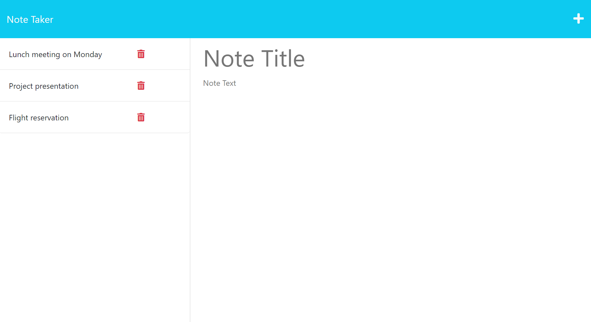

  
  # Note Taker

  ## Description

  This application allows the user to save notes and use it for future reference. 

  ## Table of Contents

  * [Installation](#installation)
  * [Usage](#usage)
  * [Project URL](#project-url)
  * [Project Image](#project-image)
  * [Credits](#credits)
  * [License](#license)
  * [Questions](#questions)
  
  ## Installation

  Download the code in your local machine and run `npm install` in the terminal. Also make sure 'node' is installed in your machine. Run server.js in the terminal using command `nodemon server`, then server starts running at PORT:3001. You can open the application in the browser making a HTTP request to http://localhost:3001.  

  ## Usage

  When you click on 'Get Started' button you are presented with a page where you can add notes and save it for future reference. You can also delete unwanted notes by clicking on delete button of the respective note.
  

  ## Project URL

  URL link to the note-taker webpage:
  (https://saritha-note-taker.herokuapp.com/).

  ## Project Image
  
  The following image show the web application's appearance and functionality:

  

  ## Credits

  Built this application based on the knowledge gained from bootcamp activities.

  ## License

  This project is licensed under the MIT license.

  ## Questions

   Check out the code and my other projects at [saritha2708](https://github.com/saritha2708).
   
   If you have any questions reach out to me at [saritha.2708@gmail.com](mailto:saritha.2708@gmail.com).

  